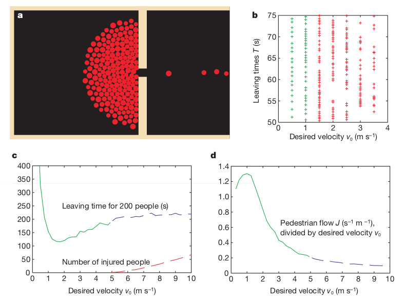

# Evacuation

Adam Yesvotny, Changjun Lim

[abstract]

We will recreate the model proposed by Helbing, Farkas and Vicsek [1], which describes pedestrian behaviors, including panic and jamming, in the evacuation process. There have been many approaches to describe the evacuation process, from a celluar automaton model [2] and a game theory [3] to an agent based model and a physical model [1]. We will replicate the model in which there is a single exit with a large crowd and visualize it. We then try to extend the model by inserting some barriers in front of a door and observe the changes in the evacuation time.

## Experiments
The original research paper ran multiple experiments that we would like to replicate.
First, a single exit with a large crowd. This will let us validate our model matches the original paper.

We want to extend our software to allow arbitrary map input, so that we can experiment with different environments, including a widened corridor, multiple doors, etc.

The original paper implemented herding behavior and low visibility, but these are probably out of scope.

Our biggest technical risk is 1. making a usable physics simulation, 2. making agents have goals. After discussing the problems with peers and reading on the internet, we concluded that making a physics simulation is feasible, and that the agents can have simple goals while still creating interesting phenomena.

The original paper has very effective data visualization that we want to replicate and learn from.

Possible output graphs.

http://angel.elte.hu/panic/
http://angel.elte.hu/panic/pdf/panicLetter.pdf

### Annotated Bibliography

[1] [**Simulating dynamical features of escape panic**](https://www.nature.com/nature/journal/v407/n6803/abs/407487a0.html)

Helbing, D., Farkas, I., & Vicsek, T. (2000). Simulating dynamical features of escape panic. Nature, 407(6803), 487-490.

[2] [**Cellular automaton model for evacuation process with obstacles**](http://www.sciencedirect.com/science/article/pii/S0378437107003676)

_Varas, A., Cornejo, M. D., Mainemer, D., Toledo, B., Rogan, J., Munoz, V., & Valdivia, J. A. (2007). Cellular automaton model for evacuation process with obstacles. Physica A: Statistical Mechanics and its Applications, 382(2), 631-642._

Varas, Cornejo, Mainemer, Toldeo, Rogan, Munoz and Valdivia simulate the behavior of pedestrian evacuating a room with a fixed obstacles so that they can find the effect of obstacles in an evacuation. They use the 2D cellular automation model in which pedestrian movement is determined by a static floor field, interaction with others and 'panic'. They experiment the evacuation process by changing the width and position of exit doors. They find that increasing exit width beyond the critical value does not reduce evacuation time and corners of the room are the worst position for an evacuation.

[3] [**A game theory based exit selection model for evacuation**](http://www.sciencedirect.com/science/article/pii/S037971120600021X)

Lo, S. M., Huang, H. C., Wang, P., & Yuen, K. K. (2006). A game theory based exit selection model for evacuation. Fire Safety Journal, 41(5), 364-369.

Lo, Huang, Wang and Yuen integrate non-cooperative game theory with evacuation model to study the behavioral reation of the evacuees. Their non-cooperative game theory model has been established to test how how the evacuation pattern will be affected by rational interaction between evacuees. In their model, evacuees perceive the actions of others and the environmental condition and decide their escape route. They fuind the mixed-strategry _Nash Equilibrium_ for the game which describes the congestion states of exits. They suggest to examine the effect of familiarity and 'grouping' effect on further studies.